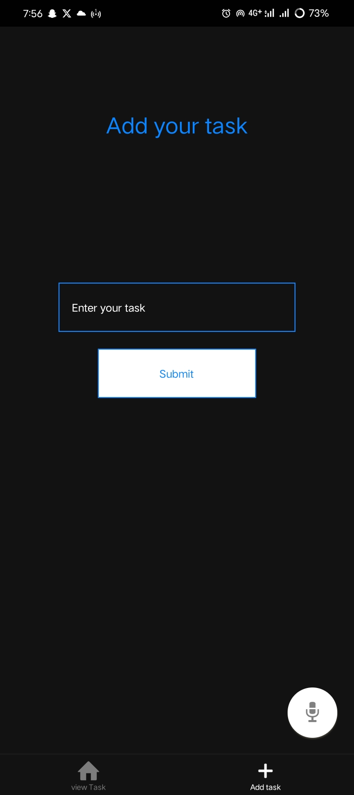
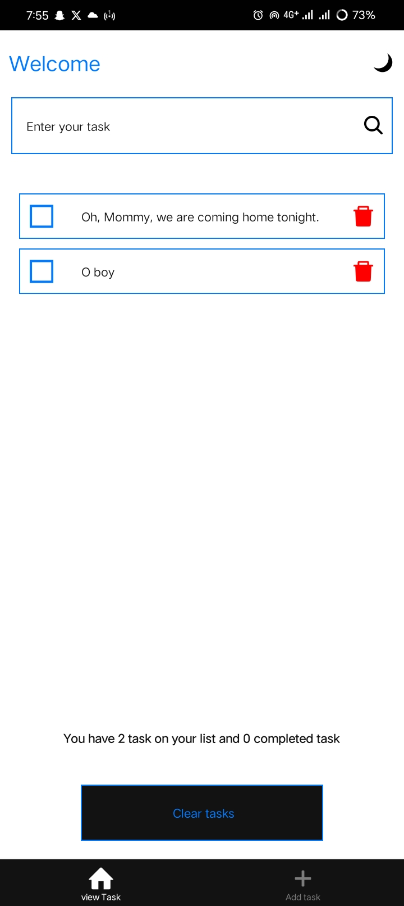
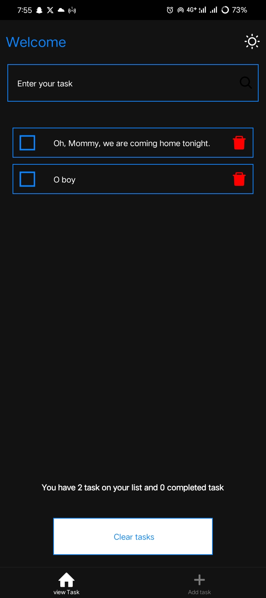
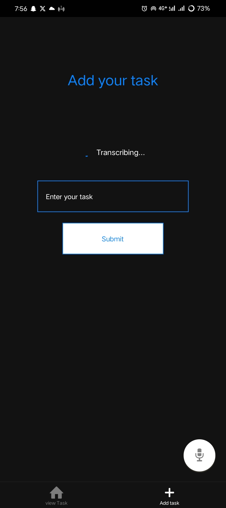
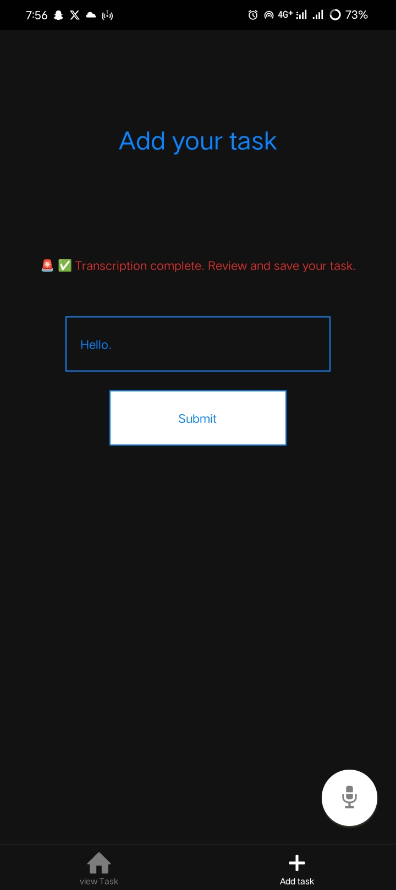

# Todo App with Voice Task Input

A React Native Todo app that allows users to **create tasks manually or via voice dictation**, automatically splitting dictated tasks into multiple items. Built with **Expo**, **AssemblyAI**, and **Zustand** for state management.

---

## Features

- Add tasks manually via text input.
- Record voice tasks and transcribe using AssemblyAI.
- Mark tasks as completed/uncompleted.
- Delete tasks.
- Responsive UI with dark/light theme support.
- Animated microphone button during recording.

---

## Screenshots

*(Optional: add screenshots here of the app, task list, and recording UI)*
### Add Task Screen






---

## Installation

1. Clone the repository:

```bash
git clone https://github.com/wetwan/todo.git
cd todo

- the api key will be attached to the email 
